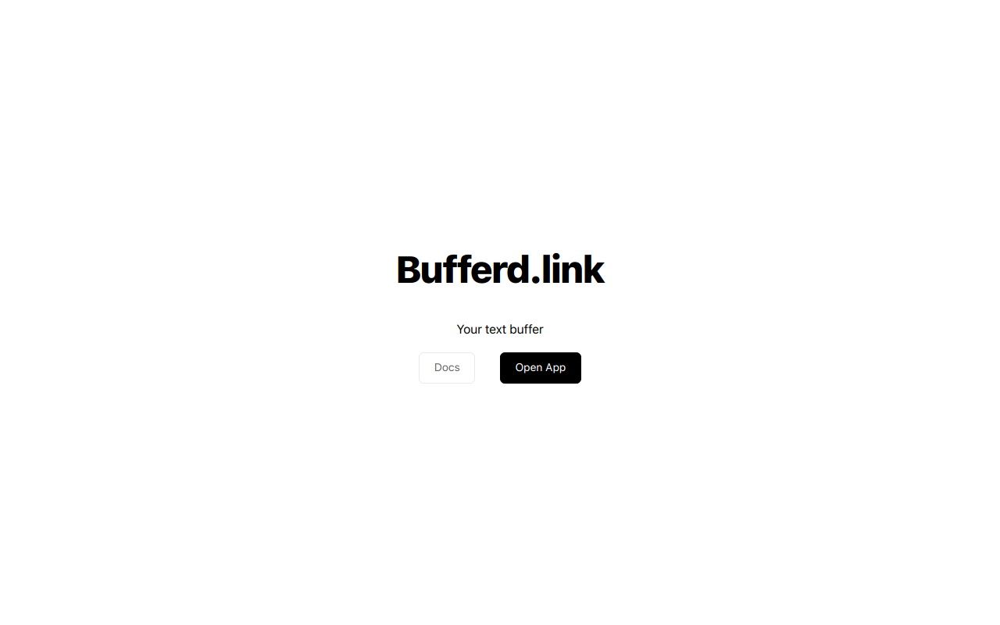

# Buffered.link



# PlanetScale x Hashnode Hackathon

[Buffered.link](https://buffered.link/) A tool to share text between connected devices via.

## Setting Up

Clone this repository

```shell
https://github.com/JosiasAurel/buffer.git
```

Navigate to the app directory

```shell
cd buffer/packages/app
```

Install dependecies

```shell
yarn install
```

Go to planetscale and create a new database.
Make sure to add the following in your `.env` file

```env
DATABASE_URL=<your-database-url>
```

Start the development server with `yarn dev`

## Building the CLI from source

The CLI is written in GoLang so you should make sure to have it locally.

After you have cloned this repository, navigate to the CLI directory.

```shell
cd buffer/packages/app
```

The CLI uses only the Go standard library and so there is no dependency to install.

Build the CLI with the following command

```shell
go build main.go
```

For a more optimized binary size, run

```shell
go build -ldflags="-s -w" main.go
```

Instructions on setting up the CLI are found [here](https://buffered.link/docs)
